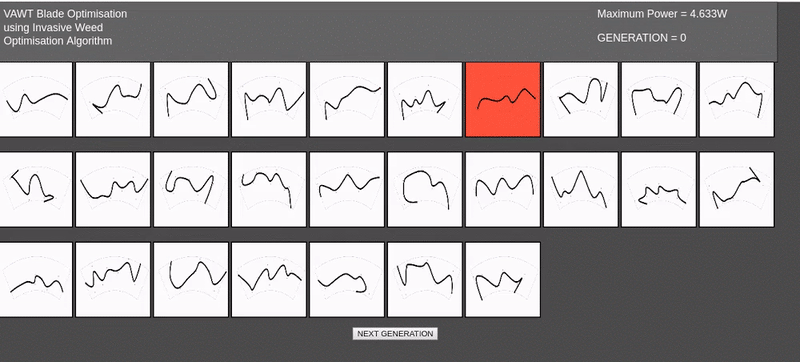
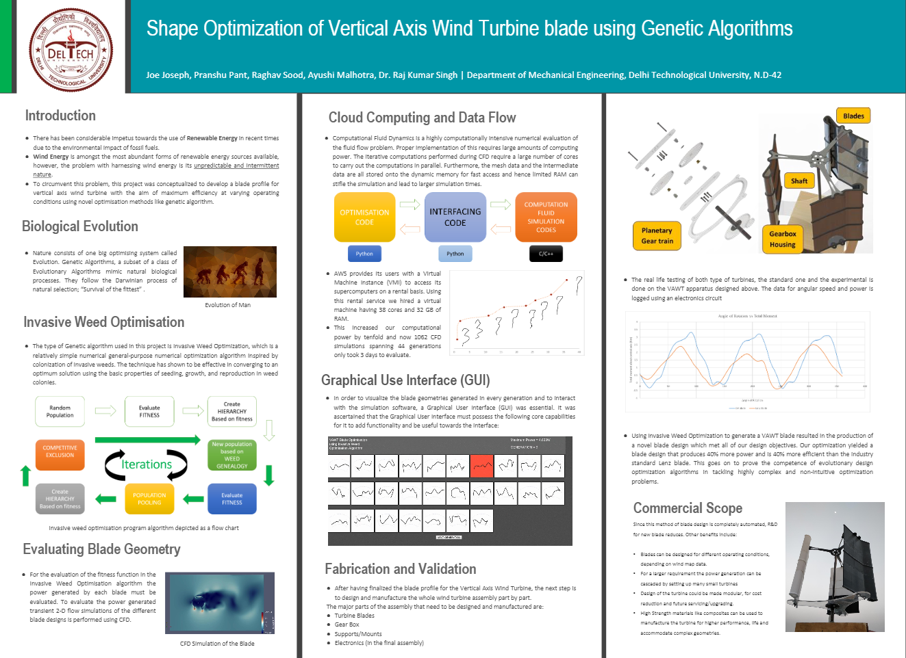

# Shape-Opt VAWT

## Overview

  * This is a repository for the major project titled - **Shape Optmisation of a Vertical Axis Wind Turbine using Invasive Weed Optimisation.**

  * The transient CFD simulation of the VAWT has been performed using OpenFOAM.

  * The VAWT blade optimization is performed using the Invasive Weed Algorithm (IWO).

  * The GUI for visualizing the CFD simulation has been developed using JavaScript.

  * [Google Drive Link](https://drive.google.com/open?id=1KG3uxdYHhK2J6CRsp908l-CCoj50akg1) for the project.

  * Developed by [Pranshu Pant](https://github.com/pranshupant) and [Joe Joseph](https://github.com/joejoseph007) for their Undergraduate Thesis, at Delhi Technological University.

----

## GUI for Blade Optimization Visualization

## Transient CFD simulation of Optimized Blade Geometry

## Project Report

